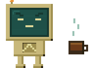
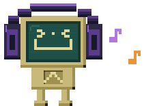
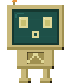
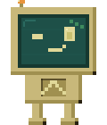
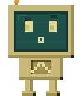

# LinuxPal

A tiny pixel-art desktop mascot for **Hyprland / Wayland**. It sits on your screen as an
`wlr-layer-shell` overlay, reacts to what you're doing (coding, browsing, watching, listening),
roams freely across your monitors, and pops up a speech bubble with a tip + joke from a local LLM.

<p align="center">
  
  
  
</p>

---

## Features

- **Context-aware states** — picks a mood from the active window (editor → working, browser →
  alert, media → jamming/cozy, …).
- **Dual-monitor priority** — on two screens, state is decided by the **HDMI** monitor; on one
  screen, by the focused workspace. No more flicker when focus bounces between displays.
- **Free roaming** — wanders in 2D across the whole desktop, hops between monitors at shared
  edges (*"a doorway!"*), and bumps outer walls (*"a wall here…"*).
- **Music & video aware** — detects real playback via MPRIS (`playerctl`): music → dances,
  plain YouTube video → cozy. Scoped to the deciding window so a video on another screen
  doesn't hijack the mood.
- **Local LLM tips** — speech bubble with a TIP + JOKE from Ollama (optional).
- **Ask it anything** — `linuxpal-ctl ask "…"` streams a short LLM answer into the bubble live.
- **Control socket** — summon, ask, force a mood, or run a routine from a Hyprland keybind or any
  script (`linuxpal-ctl`, or raw `socat`).
- **Morning routine** — one trigger launches your daily apps in order (no LLM), configured in
  `~/.config/linuxpal/morning.toml`.
- **Startup greeting** — cheers you on at login.
- **Survives monitor power-off** — re-pins to a remaining screen instead of dying.

---

## States

| State | Sprite | Trigger |
|-------|--------|---------|
| Idle |  | bare shell / empty workspace |
| Working |  | editor or terminal (nvim, vim, code, kitty, …) |
| Alert |  | browser focused |
| Thinking |  | file manager |
| Happy |  | build/tests passed · startup greeting |
| Jamming |  | music playing (mpv, Spotify, music.youtube) |
| Cozy |  | watching a plain YouTube video · PDF/e-reader |
| Curious |  | idle on the desktop a while |
| WorkingEmpty |  | working non-stop too long ("more coffee?") |
| TrainingDone |  | window title says a training run finished |
| Walk |  | free-roam travel between spots |

---

## Requirements

- **Hyprland** (uses `hyprctl` for per-monitor window context)
- `playerctl` — playback detection
- `mpv-mpris` — only if you want mpv detected on MPRIS
- **Ollama** running locally — optional, for bubble tips (without it the bubble just stays blank)
- Rust toolchain (to build)

---

## Build & install

```sh
./install.sh
```

Builds release, installs the binary to `~/.local/bin/linuxpal` and sprites to
`~/.local/share/linuxpal/sprites/`, and adds the Hyprland autostart entry (once). Re-run after
any code or asset change.

Manual run (no install):

```sh
LINUXPAL_ASSETS=assets/sprites cargo run --release
```

---

## Autostart

`install.sh` appends this to `~/.config/hypr/UserConfigs/Startup_Apps.conf`:

```ini
exec-once = env LINUXPAL_ASSETS=$HOME/.local/share/linuxpal/sprites $HOME/.local/bin/linuxpal
```

It launches every login and greets you. `exec-once` runs at session start, not on `hyprctl
reload`.

---

## Configuration

Edit `~/.config/linuxpal/config.toml` (written with defaults on first run), then
restart (`super+shift+P` twice). No rebuild needed.

| Key | Meaning |
|-----|---------|
| `hdmi_match` | substring of the monitor that decides state on dual screens (default `"hdmi"`) |
| `model` | Ollama model for tips + ask (default `qwen2.5:1.5b`) |
| `greet_msg` | startup greeting text |
| `walk_every` | how often a roam starts (ticks; 10 = 1s) |
| `walk_duration` | length of a non-music roam |
| `walk_step` | px moved per tick |
| `park_duration` | dance-in-place time per spot while music plays |
| `curious_after` / `coffee_after` | idle / working timeouts |

Env knobs:
- `LINUXPAL_ASSETS` — sprite directory.
- `RUST_LOG=info` — verbose logging.

If Ollama is unreachable (off, or GPU busy training), the bubble falls back to a
curated **offline tip/joke** bank per state instead of going blank.

---

## How it works

```
hyprctl poll (ipc.rs) ─┐
playerctl poll (player.rs) ─┤
                            ├─> resolve_state + priority ─> Animator ─> renderer ─> wl buffer
wayland outputs (main.rs) ─┘                                   │
                                                     bubble (LLM tip/joke)
```

- **`ipc.rs`** — polls Hyprland (~3 Hz). Dual screen → HDMI monitor's active-workspace window;
  single → focused monitor's. Feeds a `WindowContext` (class + title).
- **`player.rs`** — polls MPRIS (~1 Hz) → music/video flags + the playing track's title/url.
- **`context.rs`** — maps a window to a `State`; `media_applies` matches the playing track to the
  deciding window so cross-screen audio doesn't leak.
- **`sprites.rs`** — sprite loading + the `Animator` frame timing per state.
- **`main.rs`** — Wayland layer-shell surface, the per-tick state machine, global-coordinate
  roaming across all outputs, monitor hop (`pin_to`), drag-to-move, and rendering.
- **`bubble.rs`** / **`renderer.rs`** — speech bubble (bitmap font, TIP/JOKE + plain modes) and
  ARGB blitting.
- **`llm.rs`** — async Ollama queries: ambient `TipJoke` tips and streamed `ask` answers, both
  posted over one bubble channel the main loop drains each tick.
- **`control.rs`** — Unix control socket → `ControlEvent`s (summon / ask / morning / say / state /
  quit). The single entry point external triggers reuse.
- **`morning.rs`** — reads `morning.toml` and launches your daily apps via `hyprctl dispatch exec`.

---

## Controls

- **Tap** the mascot (quick click) → opens a small **action menu** beside it: morning routine,
  terminal, browser, ask, quit. Tap a row to run it; tap anywhere to dismiss.
- **Hold** (~350ms) then drag, or just click-and-drag past a few px → **reposition** it.
- **Ask** (menu → `ask`) → type your question right in the pet's bubble; **Enter** sends (answer
  streams in), **Esc** or a tap cancels. Keyboard is grabbed only while typing.
- **Start / stop** without a terminal → bind a key to the `linuxpal-toggle` script (quits if
  running, launches if not). `install.sh` installs the script; add the bind to your Hyprland
  keybinds, e.g. `bindd = $mainMod SHIFT, P, toggle LinuxPal, exec, $HOME/.local/bin/linuxpal-toggle`.
  So after the menu's **quit**, the same key brings it back.

### Talk to it (control socket)

LinuxPal listens on a Unix socket at `$XDG_RUNTIME_DIR/linuxpal.sock`. The `linuxpal-ctl` helper
(installed alongside the main binary) sends commands:

```sh
linuxpal-ctl summon                       # pop up and wave
linuxpal-ctl ask "how do I list open ports?"   # streamed LLM answer in the bubble
linuxpal-ctl say "build done"             # show a one-off message
linuxpal-ctl morning                      # run the morning launch routine
linuxpal-ctl state jamming                # force a mood for a few seconds
linuxpal-ctl quit                         # stop it
```

No helper needed in a pinch — any socket client works:

```sh
echo 'ask what is a tmpfs?' | socat - "UNIX-CONNECT:$XDG_RUNTIME_DIR/linuxpal.sock"
```

Wire it to Hyprland keybinds (`~/.config/hypr/.../UserKeybinds.conf`):

```ini
bind = SUPER, P, exec, linuxpal-ctl summon
bind = SUPER, M, exec, linuxpal-ctl morning
bind = SUPER, A, exec, linuxpal-ctl ask "$(fuzzel --dmenu --prompt 'ask> ')"
```

The `ask` bind turns a launcher prompt (`fuzzel`/`wofi`/`rofi`) into a question box from anywhere —
no in-surface keyboard handling required.

### Morning routine

`linuxpal-ctl morning` launches your daily apps in order via `hyprctl dispatch exec`. First run
writes a commented default to `~/.config/linuxpal/morning.toml`:

```toml
[[apps]]
cmd = "zen-browser"

[[apps]]
cmd = "kitty"
args = "-e tmux new-session -As main"

# add what you want — e.g.:
# [[apps]]
# cmd = "spotify"

# optional per-app pause before the next launch
# [[apps]]
# cmd = "xfreerdp"
# args = "/v:HOST /u:USER +clipboard"
# delay_ms = 2000
```

---

## Notes / limits

- Layer-shell surfaces are per-output, so a monitor hop is a *jump* at the seam, not a smooth
  straddle.
- A browser is a single MPRIS player across all its tabs/windows, so background-tab audio on the
  deciding window can't always be attributed — detection matches the foreground tab title.
